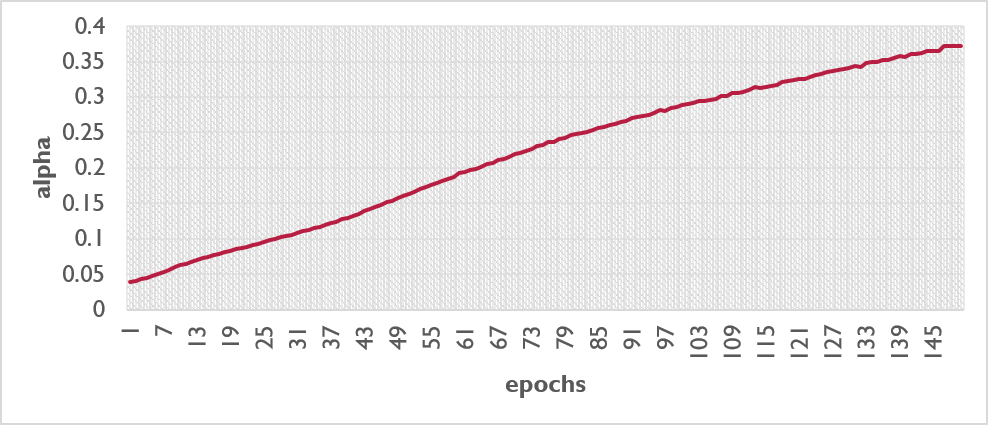

# MixPro: Constrained Reproduction and Critical Analysis
Base Paper: MixPro: Data Augmentation with MaskMix and Progressive Attention Labeling for Vision Transformer (ICLR 2023)

## 1. Abstract
This project focuses on reproducing the MixPro data augmentation strategy for Vision Transformers (ViTs). We conduct a partial reproduction under limited compute using a deterministically constructed subset of the original dataset. Rather than aiming for exact headline scores, we test whether the relative performance trends hold under contrained Learning conditions.

MixPro addresses limitations in prior Mixup-based methods by introducing two novel components: MaskMix (image space) and Progressive Attention Labeling (PAL) (label space). This repository contains a PyTorch implementation, partial reproduction results on a subset of ImageNet-1k, a scientific critique of the methodology, and a proposed improvement.

## 2. Background & Motivation
Vision Transformers (ViTs) generally require massive datasets to generalize well. While data augmentation techniques like CutMix and TransMix have helped, the authors identify specific issues when applied to ViTs:

  -  Image Space Deficit: Methods like CutMix use region-based cropping (a large rectangular block). This destroys the global context that ViTs naturally rely on for self-attention.

  -  Label Space Noise: TransMix uses the model's attention map to determine label mixing ratios. However, early in training, attention maps are unreliable, leading to noisy label assignments.

## 3. Methodology

### 3.1. MaskMix (Image Space)
Instead of a single large crop, MaskMix uses a grid-mask strategy.
* **Logic:** A binary mask $M$ mixes two images $x_i$ and $x_j$: $\tilde{x} = M \odot x_i + (1-M) \odot x_j$.
* **Constraint:** The mask patch size ($P_{mask}$) is a multiple (e.g., $4\times$) of the ViT input patch size. This ensures every token processed by the ViT comes from exactly one image.

### 3.2. Progressive Attention Labeling (PAL) (Label Space)
PAL solves the "unreliable attention" problem by introducing a dynamic weight $\alpha$.
* **The Formula:**
    $$\lambda = \alpha \cdot \lambda_{attn} + (1-\alpha) \cdot \lambda_{area}$$
* **Mechanism:** $\alpha$ measures model confidence.
    * **Low Confidence (Early Training):** $\alpha \to 0$. We trust the pixel area ($\lambda_{area}$).
    * **High Confidence (Late Training):** $\alpha \to 1$. We trust the attention map ($\lambda_{attn}$).

## 4. Experimental Setup: The "Stress Test"

To evaluate the robustness of MixPro, we devised a Transfer Learning Stress Test. We deviated from the paper's "from-scratch" setup to test if MixPro provides value when fine-tuning pre-trained models on smaller datasets.

| Feature | Original Paper Setup | Our project | Additional Experiment |
| :--- | :--- | :--- | :--- |
| **Dataset** | ImageNet-1k (1.28M images) | ImageNet Subset | ImageNet Subset |
| **Epochs** | 300 Epochs | 150 Epochs | 100 Epochs |
| **Initialization** | **Random (From Scratch)** | **Random (From Scratch)** | **Pre-trained (ImageNet)** |
| **Backbone** | DeiT-Tiny | DeiT-Tiny | DeiT-Small / DeiT-Tiny |

Important: This leads to differences from the paper’s ImageNet-1K training regime (full dataset, larger epochs, etc.), so reported accuracies should be interpreted as **“in our constrained regime”** only.


## 5. Experimental Results
### 5.1 Partial Reproduction Results
Evaluating using Top-1 Accuracy
| Model | Baseline |  Transmix | Mixpro |
| :--- |  :--- | :--- | :--- |
| **DeiT-Tiny** | **34.07%** | **35.18%** | **33.08%** |

Under a compute-constrained reproduction (ImageNet-1K subset + 150 epochs, from scratch), we did not observe MixPro outperforming TransMix on DeiT-Tiny. Instead, TransMix improves over baseline (+1.11 pp), while MixPro underperforms (–2.10 pp vs TransMix). This suggests MixPro’s reported advantage may be sensitive to training budget and/or data scale, or may require the full 300-epoch regime to realize its benefit.
The PAL confidence also remained low throughout training (α_mean ≈ 0.04 → 0.37 by epoch 145), meaning λ_final was dominated by area-based mixing for most epochs. Under this constrained setting, MixPro likely did not transition into the attention-reliant regime where it is expected to outperform, while TransMix benefits from attention guidance from the start.



### 5.2 Quantitative Results (Top-1 Accuracy)
We also evaluated the models in a **Transfer Learning** regime (Pre-trained on Imagenet1k).

| Model | MixPro (Ours) | TransMix | Best Method |
| :--- |  :--- | :--- | :--- |
| **DeiT-Small** | 75.65% | **77.42%** | TransMix |
| **DeiT-Tiny** | **70.77%** | 69.90% | **MixPro** |

### 5.2 Critical Analysis

Our results reveal a distinct interaction between Model Capacity and Augmentation Strategy, highlighting a limitation in the MixPro methodology when applied to Transfer Learning. Pretraining changes the early attention quality, so it’s a deliberate test of the method’s claimed mechanism : if PAL helps because attention is unreliable early, then in a pretrained regime we should expect the PAL benefit to shrink.

1.  **DeiT-Tiny Favors MixPro:**
    For the capacity-constrained Tiny model, **MixPro** achieved the highest accuracy (**70.77%**).
    *  Smaller models may benefit significantly from the aggressive regularization provided by **MaskMix** (Grid Masking). The paper notes MixPro performs better on models with fewer parameters. This is consistent with MixPro acting as a stronger regularizer in a lower-capacity regime, where patch-level mixing can improve generalization on limited data.

2.  **DeiT-Small Favors TransMix:**
    For the larger Small model, **TransMix** achieved the highest accuracy (**77.42%**).
    *  In the pretrained setting, attention maps may be informative early, so TransMix can benefit immediately. PAL’s delayed reliance on attention may therefore be less beneficial (or slightly restrictive) in transfer learning.

## 6. Proposed Improvement: Entropy-Based PAL

The original PAL calculates confidence ($\alpha$) using Cosine Similarity between logits and the Ground Truth label13. This creates an artificial dependency where the model "peeks" at the label to determine confidence. We propose an Entropy-based Confidence measure.
A model should determine confidence based on the sharpness of its own predictions (Entropy), independent of the label.

**Formula:**
$$\alpha = 1 - \frac{Entropy(p)}{MaxEntropy}$$

| Feature | Cosine Similarity (Feature Distance) | Entropy Based | 
| :--- |  :--- | :--- | 
| **Focus** | Global Texture. It asks "Did the image style/pixels change?"| Semantic Relevance. It asks "Did I lose the object?"|
| **Sensitivity** | Low. Removing a dog's nose is a tiny pixel change, so Cosine Similarity would barely register a difference.| High. Removing a small but crucial part (like a dog's nose) triggers a large label change because attention was high there|
| **Computation** | Expensive. Requires an extra forward pass or feature extraction to compare the "before" and "after" embeddings.| Efficient. Uses the attention map already computed in the Transformer block.|

By using entropy confidence, instead of cosine similarity, the following results were noted:
| Model | MixPro (Cosine similarity) | MixPro (Entropy confidence) | Δpp |
| :--- |  :--- | :--- | :--- |
| DeiT-Tiny | 33.08% | 37.49% | 4.41pp |

The change in the alpha calculation method increased the Top-1 accuracy from 33.08% to 37.49%, a +4.41 percentage-point gain. Entropy provides a smoother and more reliable confidence signal early in training, improving PAL’s weighting. This is a promising improvement, but it’s currently validated in a limited setting and should be tested across seeds and backbones.

## 7. Conclusion:
Overall, we used the results from the MixPro pipeline under compute limits to test the paper’s logic. Firstly, we saw that MaskMix-style regularization can be more beneficial when model capacity is limited. By reducing the epochs/data, it was noted that the PAL factor remained low during training thus the λ_final was dominated by area-based mixing for most epochs. Under this constrained setting, MixPro likely did not transition into the attention-reliant regime where it is expected to outperform, while TransMix benefits from attention guidance from the start.

Secondly, by doing a reverse stress test and checking the reliability of the PAL logic when the modelis already informative, we see thatTransMix can benefit more from trusting attention immediately. : Under transfer learning, PAL’s “warm-up” of attention trust may be less aligned with the pretrained regime; this could explain why TransMix outperforms MixPro for DeiT-Small in our stress test

Finally, we implemented a simple improvement: using entropy as a label-free confidence for PAL, which gave a +4.41pp gain on DeiT-Tiny in our setup. This suggests confidence estimation is a key lever in MixPro-style methods.


## 7. Directory Structure
```
MIX-PRO-REPRO/
├── configs/
│   ├── deit_s_baseline.yaml
│   ├── deit_s_mixpro.yaml
│   ├── deit_t_baseline.yaml
│   ├── deit_t_mixpro.yaml
├── data/
│   ├── imagenet1k/
│   │   ├── train/
│   │   ├── val/
│   ├── imagenet1k_subset_100pc/
│   │   ├── train/
│   │   ├── val/
│   ├── raw/
│   │   ├── ILSVRC2012_devkit_t12.tar.gz
│   │   ├── ILSVRC2012_img_train.tar
│   │   ├── ILSVRC2012_img_val.tar
│   ├── tmp/
├── results/
├── scripts/
│   ├── prepare_imagenet.py     #extracts the images from the zipped tar files
│   ├── tmp/
├── src/
│   ├── data/
│   ├── methods/
│   │   ├── maskmix.py    # Mask generation logic
│   │   └── pal.py        # Progressive Attention Labeling loss
│   └── models/           # ViT wrappers to extract Attention Maps
│   │   ├── deit_s.py
│   │   ├── deit_t.py
├── train_baseline.py              # Main training loop
├── train_mixpro.py
└── README.md
```

## 8. Environment Setup

```bash
git clone github repo
cd mix-pro-repro

# (Optional) create conda env
conda create -n mixpro-repro python=3.10 -y
conda activate mixpro-repro

# Install requirements
pip install -r requirements.txt

#To run baseline:
CUDA_VISIBLE_DEVICES=<No of GPUs> torchrun --standalone --nproc_per_node= <No of GPUs>\
  -m src.train_baseline --config configs/deit_t_baseline.yaml --out results

#To run mixpro:
CUDA_VISIBLE_DEVICES=<No of GPUs> torchrun --standalone --nproc_per_node= <No of GPUs>\
  -m src.train_mixpro --config configs/deit_t_mixpro.yaml --out results

#To run mixpro improvement:
CUDA_VISIBLE_DEVICES=<No of GPUs> torchrun --standalone --nproc_per_node= <No of GPUs>\
  -m src.train_mixpro --config configs/deit_t_mixpro_improved.yaml --out results

**To run deit_s, substitute with deit_s yaml file**

```
## 9. References
[1] Zhao, Q., et al. "MixPro: Data Augmentation with MaskMix and Progressive Attention Labeling for Vision Transformer." ICLR 2023. arXiv:2304.12043

[2] Chen, J.-N., et al. "TransMix: Attend to Mix for Vision Transformers." CVPR 2022.

[3] Touvron, H., et al. "Training data-efficient image transformers & distillation through attention." ICML 2021.
